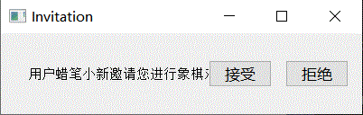

# 设计文档
## 引言
### 编写目的
本设计文档系统介绍了开发基于语音控制的游戏盒子软件的过程。
### 时间表
+ 4月30日~5月14日：编写各个游戏的模块及语音模块的代码，实现各子模块的功能。
+ 5月15日~6月2日：将游戏模块与语音模块合并，实现语音控制游戏的进行；为象棋游戏编写服务器与客户端，实现多玩家对弈。
+ 6月3日~6月6日：编写游戏盒子的总用户界面，将各游戏模块集合起来，实现整个游戏盒子的功能都能同时由语音控制和鼠标控制。
## 总体设计
### 功能需求
+ 总体上，为不方便使用鼠标的用户提供一个语音控制的游戏盒子
  + 此项目实现了将若干语音控制的游戏集成在一起，并可方便地扩展更多游戏
  + 目前已集成了中国象棋（单机、联机）、连连看、扫雷、拼图、推箱子、五子棋等游戏
+ 可供用户自由选择游戏
  + 在主界面提供所有游戏选项，用户可依自身喜好选择游戏
  + 各游戏作为模块相对独立，每次仅有用户选择的游戏被运行
+ 保留原有的用户鼠标控制游戏功能
  + 为兼容用户联机对战，方便能使用鼠标的用户一同游玩，项目保留了鼠标控制功能
+ 支持用户语音控制玩游戏
  + 各游戏均在原有的鼠标控制基础上，增加了语音控制功能
  + 支持用户使用标准普通话和预先指定的标准语音指令操作游戏
### 开发环境（见配置文档）
python 3.7
### 流程结构
程序总体流程结构如下图：

1. 打开程序进入总UI界面，语音控制模块作为一个线程一直运行，用户可以同时使用语音控制与鼠标控制进行操作。
2. 用户选择打开一个游戏，目前游戏盒子中的游戏有Chinese Chess中国象棋(联机版与单机版)、Puzzle拼图、Sokoban推箱子、Link game连连看、Gobang五子棋、Minesweeper扫雷。
3. 用户退出游戏，返回总UI界面。
## 模块设计
### 语音模块
#### 结构设计
语音模块结构流程如下图：

1. 语音识别模块启动先录制一小段音频，判断这一小段音频最大响度是否超过阈值，若没有则认为没有语音输入，重复录制小段音频并判断；若超过则开始录音。
2. 开始录制后每录制一段音频就判断刚刚这段音频最大响度是否低于阈值，若没有低于阈值则继续录制并将i值归零；若低于阈值则将i值加一并判断i值是否大于2，若不大于则继续录制，若大于则认为没有语音输入，结束录制，保存音频。
3. 最后将保存的音频发送给百度语音识别接口，并得到返回的识别结果，根据该结果执行相应的命令，并回到1.重新开始进行新的语音识别。
#### 接口设计
百度语音识别API
+ 接口功能：识别音频中的语音，转换成对应文字。
+ 接口类型：通过REST API的方式提供的通用的HTTP接口。适用于任意操作系统，任意编程语言
+ 接口限制：需要上传完整的录音文件，录音文件时长不超过60秒。浏览器由于无法跨域请求百度语音服务器的域名，因此无法直接调用API接口。
+ 支持音频格式：pcm、wav、amr、m4a
+ 音频编码要求：采样率16000、8000，16bit位深，单声道
+ 调用流程
  1. 创建账号及应用：在ai.baidu.com控制台中，创建应用，勾选开通 ”语音技术“-”短语音识别、短语音识别极速版“ 能力。获取AppID、API Key、Secret Key，并通过请求鉴权接口换取token。
  2. 创建识别请求：POST方式，音频可通过JSON和RAW两种方式提交。
  3. 短语音识别请求地址：http://vop.baidu.com/server_api
  4. 返回识别结果：识别结果会即刻返回，采用JSON格式封装，如果识别成功，识别结果放在JSON的“result”字段中，统一采用utf-8方式编码。
#### 数据设计
为满足百度语音识别的音频格式与编码要求，我们使用了pyaudio进行录制音频数据，使用wave保存音频文件。
```python
import pyaudio
import wave
CHUNK = 1024 # 单次采样分组大小
FORMAT = pyaudio.paInt16  # 16bit编码格式
CHANNELS = 1  # 单声道
RATE = 16000  # 16000采样频率
frames = [] # 音频数据储存再此变量中
p = pyaudio.PyAudio() # 实例化PyAudio
# 创建音频流
stream = p.open(format=FORMAT,
                channels=CHANNELS,
                rate=RATE,
                input=True,
                frames_per_buffer=CHUNK)

# 保存音频文件
with wave.open("./1.wav", 'wb') as wf:
    wf.setnchannels(CHANNELS)
    wf.setsampwidth(p.get_sample_size(FORMAT))
    wf.setframerate(RATE)
    wf.writeframes(b''.join(frames))
```
#### 出错处理
+ 语音控制模块使用过程中存在录制的音频质量不高等原因导致百度语音识别API识别失败返回错误错误信息，此时返回的JSON结果没有"result"字段。所以读取百度语音识别API返回的结果时需先判断有无"result"字段，若没有则直接丢弃该结果。
+ 若录制的音频中含杂音较多，百度语音识别API返回的结果常常是"我不知道"，因此，若返回结果的"result"字段为"我不知道"时也应直接丢弃该结果。
### 游戏模块
本项目小游戏是借助pygame库实现的。尽管六个游戏的内容各不相同，但他们的逻辑结构是一致的。
#### 结构设计
语音游戏模块结构流程如下图：

1. 游戏启动，初始化游戏数据及界面。
2. 等待用户指令。
3. 若接收到游戏结束指令则关闭游戏进程。
4. 若接收到其他指令则执行相应指令并更新游戏数据及界面。
#### 界面设计
+ pygame的display属性用于设置窗口大小、标题。
+ 与其他UI界面库如pyqt5不同的是，pygame能够通过不断的更新窗口实现动画效果。
  ```python
  import sys,pygame
 
  pygame.init() # 初始化pygame类
  screen = pygame.display.set_mode((600,800)) # 设置窗口大小
  pygame.display.set_caption('标题') # 设置窗口标题
  image = pygame.image.load('xx.png') # 加载图片
  clock = pygame.time.Clock()

  while True:
  
      for event in pygame.event.get(): # 事件检测
          # 如果点击右上角X，则程序退出，没有这个循环的话，窗口可能会在打开时闪退。
          if event.type == pygame.QUIT:
              sys.exit()

      screen.blit(image, (0,0),frameRect) # 这里给了3个实参，分别是图像，绘制的位置，绘制的截面框
      clock.tick(60)  # 设置图像刷新率
      pygame.display.update() # 更新窗口
  ```
#### 接口设计
人机接口
+ 游戏模块需要与用户交互，接收用户的指令，执行相应命令。pygame使用event属性实现用户交互的功能。
+ pygame的event属性相当于一个队列，当有事件发生时，使用get方法获取该事件，匹配事件的类型，执行相应的指令。
  ```python
  while True:  # 死循环确保窗口一直显示
      for event in pygame.event.get():  # 获取队列中的事件
          if event.type == 事件:  # 匹配事件的类型
              command # 执行相应指令
          elif condition:
              ···
  ```
+ 下表为常用事件类型表：
  |  事件类型  |  产生途径  |
  |  ----  |  ----  |
  |  QUIT  |  用户按下关闭按钮  |
  |  ATIVEEVENT  |  Pygame被激活或者隐藏  |
  |  KEYDOWN  |  键盘被按下  |
  |  KEYUP  |  键盘被放开  |
  |  MOUSEMOTION  |  鼠标移动  |
  |  MOUSEBUTTONDOWN	  |  鼠标按下  |
  |  MOUSEBUTTONUP  |  鼠标放开  |
  |  USEREVENT  |  触发了一个用户事件  |
+ 用户可以自己定义事件的类型并调用post方法触发该事件。
  ```python
  my_event = event.Event(USEREVENT + n) # 事件类型为USEREVENT + n，不同的指令可以设置不同的n值
  event.post(my_event)
  ``` 
### 中国象棋服务器及客户端模块
#### 结构设计
下面以客户端A、客户端B及服务器的交互流程展示中国象棋服务器及客户端模块的主要流程结构，如下图：

1. 在总UI界面选择打开中国象棋游戏后进入客户端界面。
2. 给服务器发送自己的ID；服务器接收到客户端A的ID后更新用户列表并向除A外所有客户端发送用户更新信息；其他客户端接收到用户更新消息后更新用户列表。
3. 服务器向客户端A发送用户列表，客户端A接收到用户列表后更新用户列表。
4. 选择空闲状态的客户端B发送对弈邀请（此外还可以选择游戏中状态的用户发送游戏预约），发送的消息经服务器转发给客户端B，客户端B接受对弈邀请（当然也可以拒绝对弈邀请）。
5. 客户端B回复邀请，并初始化中国象棋游戏模块，开始游戏；服务器接收到回复邀请向客户端A转发回复
6. 服务器将客户端A与客户端B的状态更新为游戏中并向所有客户端发送状态更新信息；所有客户端接收到用户状态更新信息后更新客户端A与客户端B的状态信息。
7. 客户端A收到客户端B的回复邀请，初始化中国象棋游戏模块，开始游戏，由邀请方先行棋，被邀请方后行棋。
8.  一位用户行棋后将行棋信息通过服务器发送给另一用户，另一用户接收到行棋信息后更新棋盘信息并开始行棋。
9.  客户端A结束游戏，将该信息发给服务器；若对弈胜负未分，服务器会告知客户端B对手已逃跑；客户端B接收到逃跑信息后结束游戏。
10. 服务器更新用户状态为空闲并向所有客户端发送用户状态更新信息；所有客户端接收到用户状态更新信息后更新用户状态。
11. 用户退出客户端A，将退出信息发给服务器；服务器接收到退出信息后删除该用户并向所有客户端发送用户更新信息；其他客户端接收到用户更新消息后更新用户列表。
#### 接口设计
客户端与服务器的通信
+  客户端与服务器的通信借助socket通信实现
+  服务器在本地开放一个端口并对该端口进行监听。若监听到一个客户端连接，便为其打开一个线程用以接收来自该客户端的信息。此后根据接收到客户端信息的类型进行转发信息或广播信息。
    ```python
    import socket

    class Server:

        def __init__(self):
            self.server = socket.socket() # 初始化socket
            self.server.bind(("127.0.0.1", 8989)) # 开启端口
            self.server.listen(10) # 开启监听
            self.get_conn()

        def get_conn(self):
            while True:
                client, address = self.server.accept() # 接收客户端的连接
                Thread(target=self.get_msg, args=(client, address)).start() # 开启线程用以接收该客户端的消息
    ```
+  客户端开启后尝试连接服务器的相应端口，若连接成功便打开一个线程用以接收来自服务器的消息。此后客户端根据用户的指令向服务器发送消息。
    ```python
    import socket

    class Client(QWidget):

        def __init__(self):
            self.client = socket.socket() # 初始化socket
            self.client.connect(("127.0.0.1", 8989)) # 连接服务器相应端口
            Thread(target=self.get_msg).start() # 开启线程用以接收服务器的消息
    ```
人机交互
+ 客户端需要接收用户的指令，执行相应命令。除了语音指令外，客户端使用了pyqt5的connect方法允许用户点击按钮进行交互。
  ```python
  self.exit_button.clicked.connect(self.exit_program) # 点击退出按钮触发执行退出程序函数
  self.list1.clicked.connect(self.invite_user) # 点击空闲用户列表中的任意用户触发执行给相应用户发送邀请函数
  self.send_button1.clicked.connect(self.accept) # 点击接受按钮触发执行接受邀请函数
  ```
#### 数据设计
消息格式
+ 通过socket发送的消息必须为数据流格式
  ```python
  send_msg = {'type': 'userlist', 'userlist': self.user_dicts} # 发送一个字典
  send_json = json.dumps(send_msg) # 对发送的字典格式化，转换成JSON格式
  client.send(send_json.encode()) # 对JSON数据编码，转换成数据流
  ```
+ 接收到消息后根据消息的'type'字段进行相应的处理
  ```python
  recv_json = self.client.recv(1024).decode() # 对数据流解码，转换成JSON格式
  recv_msg = json.loads(recv_json) # 对JSON数据解码，转换成字典
  # 根据'type'字段进行相应的处理
  if recv_msg['type'] == type1:
      command
  elif recv_msg['type'] == type2:
      command
  ···
  ```
用户列表
+ 服务器与客户端都储存一个用户列表，用户的信息包括socket地址、ID、状态储存在一个字典里，所有用户的字典一起储存在一个列表中。
  ```python
  user_dict = {'address': address, 'name': recv_msg['name'], 'status': '空闲'}
  self.user_dicts.append(user_dict)
  ```
#### 界面设计
客户端使用pyqt5进行界面设计
+ 获取用户ID界面  
    
  输入id后点击确认按钮，会向服务器发送id并关闭此界面。
+ 客户端主界面  
    
  两种状态的用户分别在两个用户列表中，点击退出按钮退出客户端，点击用户会向其发送对弈邀请或预约。
+ 收到对弈邀请与预约界面  
    
    
  点击接受或拒绝按钮会向服务器发送相应回复消息，接受对弈邀请时会打开游戏界面。
+ 提示界面  
    
  当成功发起邀请或预约、预约成功或失败、邀请失败、对手逃跑时都会弹出提示窗口，该窗口弹出1.5秒后自动关闭。
#### 出错处理
由于在客户端中使用了线程用以接收服务器的消息，而接收到消息后往往需要进行相应操作，需要调用主线程的资源。若接受到消息后直接在该线程中进行操作，可能会发生阻塞现象，导致程序崩溃。需要利用信号与槽函数解决该问题。
```python
signal = pyqtSignal() # 定义信号
self.signal.connect(self.startgame) # 将该信号与槽函数绑定

# 接收消息线程
if recv_msg['type'] == 'accept':
    self.signal.emit() # 发送信号触发槽函数
```
### 主界面模块
#### 界面设计
主界面使用pyqt5进行界面设计。  
  
#### 接口设计
人机交互
+ 与客户端相同主界面使用了pyqt5的connect方法允许用户点击按钮进行交互。
  ```python
  self.button_1.clicked.connect(self.game_1) # 点击按钮开始游戏或退出主界面
  ```
开始游戏
+ 使用system函数在cmd中运行命令以打开相应游戏。
  ```python
  def game_1(self):
      os.system('python ./ChineseChess/main.py') # 使用system函数在cmd中运行命令以打开相应游戏
  ```
#### 出错处理
由于os.system函数是阻塞的，意味着打开一个游戏后主界面就被阻塞了，此时无法对主界面进行任何操作。